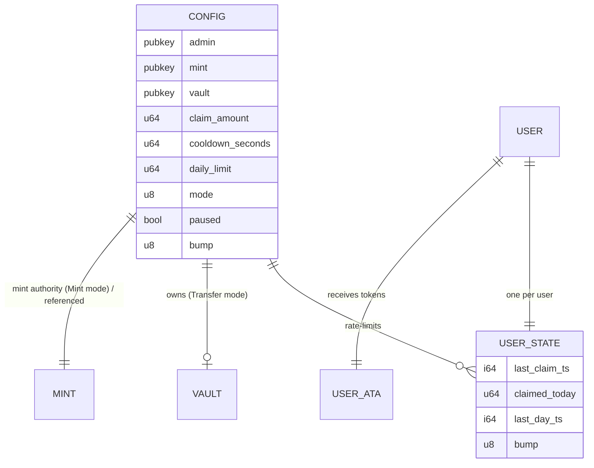
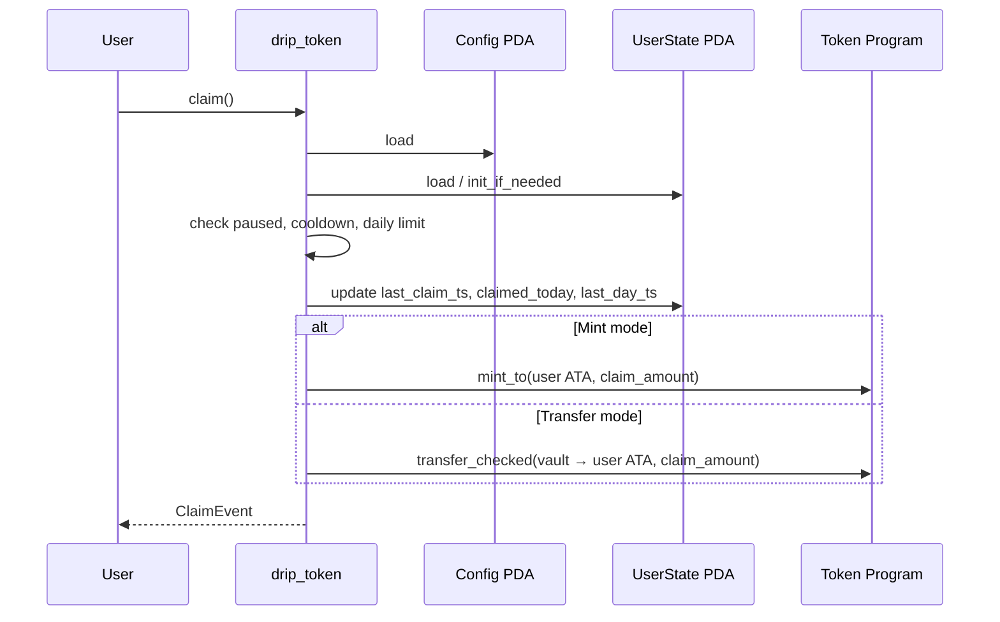

# DripToken

Production-quality, intentionally simple SPL token faucet on Solana (Anchor).

Users claim a fixed amount of a configured SPL token. The program enforces a per-user cooldown and/or a rolling 24-hour daily limit, supports both mint and transfer modes, and is designed for clarity, safety, and easy auditing.

**Design philosophy**: minimal moving parts, fixed-size accounts, state-before-effects, no unbounded growth, descriptive errors and events.

---

## Architecture Overview

The program (`drip_token`) maintains two persistent account types:

| Account     | Seeds                          | Purpose                                      |
|-------------|--------------------------------|----------------------------------------------|
| **Config**  | `[b"config"]`                  | Singleton global faucet configuration        |
| **UserState** | `[b"user", user.key().as_ref()]` | Per-user rate-limit state (`init_if_needed`) |

Token movement occurs in one of two modes (set in Config):

- **Mint mode (`mode = 0`)** – Config PDA is the mint authority; `claim` calls `token_interface::mint_to`.
- **Transfer mode (`mode = 1`)** – Config PDA owns a vault token account; `claim` calls `token_interface::transfer_checked`. Vault balance must be **strictly greater than** `claim_amount`.

All critical UserState updates happen **before** any token CPI. Both cooldown and daily limit are enforced when their respective values are > 0. A global `paused` flag can disable claims.

An admin helper `mint_to_vault` exists to fund the vault by minting into it (admin-only).

Primary token path uses `anchor_spl::token_interface` (Token-2022 compatible). Users receive tokens into their Associated Token Account for the configured mint.

### High-level claim flow

```text
User signs claim
       │
       ▼
Load Config + UserState (init_if_needed)
       │
       ▼
paused == false ?
       │
       ▼
Cooldown elapsed? (if cooldown_seconds > 0)
       │
       ▼
Daily window check / reset (if daily_limit > 0)
       │
       ▼
Update UserState (last_claim_ts, claimed_today, last_day_ts)
       │
       ▼
Mint or Transfer (exactly config.claim_amount)
       │
       ▼
Emit ClaimEvent
```

---

## Account Diagrams

### Text diagram

```text
Config PDA  seeds = ["config"]
┌─────────────────────────────────────────────────────────────┐
│ admin: Pubkey                                               │
│ mint: Pubkey          (immutable after initialize)          │
│ vault: Pubkey         (Pubkey::default() allowed in Mint)   │
│ claim_amount: u64                                           │
│ cooldown_seconds: u64 (0 = disabled)                        │
│ daily_limit: u64      (0 = disabled)                        │
│ mode: u8              (0 = Mint, 1 = Transfer)              │
│ paused: bool                                                │
│ bump: u8                                                    │
└─────────────────────────────────────────────────────────────┘

UserState PDA  seeds = ["user", user]
┌─────────────────────────────────────────────────────────────┐
│ last_claim_ts: i64                                          │
│ claimed_today: u64                                          │
│ last_day_ts: i64      (start of current rolling 24 h window)│
│ bump: u8                                                    │
└─────────────────────────────────────────────────────────────┘

Vault (Transfer mode only)
  Token account whose authority = Config PDA, mint = Config.mint
```

### Mermaid – account relationships



### Mermaid – claim sequence (happy path)



---

## Instructions

| Instruction        | Admin only? | Description |
|--------------------|-------------|-------------|
| `initialize`       | Yes        | Creates Config PDA. Sets admin, mint, claim_amount, limits, mode, paused. Mint becomes immutable. |
| `claim`            | No         | User claims exactly `config.claim_amount`. Enforces pause + both limits. Updates UserState before CPI. |
| `update_config`    | Yes        | Updates `claim_amount`, `cooldown_seconds`, `daily_limit`, `mode`, `paused`, `admin`. Cannot change mint. |
| `set_vault`        | Yes        | Sets or replaces the vault token account. New vault must match mint and have Config PDA as authority. |
| `close_user_state` | No         | User closes own UserState and recovers rent. Allowed only when rate-limit state is fully clean. |
| `mint_to_vault`    | Yes        | Admin helper: mints a caller-supplied amount into the vault (Config PDA signs as mint authority). |

### Account requirements (summary)

**initialize**
- Signer: future admin
- Config PDA (init)
- Mint account
- System program

**claim**
- Signer: user
- Config PDA
- UserState PDA (`init_if_needed`)
- User’s ATA (`init_if_needed` where appropriate)
- Vault token account (always required by current constraints, even in Mint mode)
- Mint
- Token program / Associated Token program / System program as needed

**update_config**
- Signer: current `config.admin`
- Config PDA

**set_vault**
- Signer: current `config.admin`
- Config PDA
- New vault token account (must be for `config.mint`, authority = Config PDA)

**close_user_state**
- Signer: user (owner of the PDA)
- UserState PDA
- Conditions: `claimed_today == 0` and cooldown fully elapsed (or `cooldown_seconds == 0`)

**mint_to_vault**
- Signer: current `config.admin`
- Config PDA
- Vault (must already be authorised by Config PDA)
- Mint
- Token program

---

## Security Considerations & Invariants

The program assumes hostile clients. Key invariants that must always hold:

1. **Singleton Config** – seeds = `[b"config"]`.
2. **Unique UserState** – seeds = `[b"user", user.key().as_ref()]`.
3. **State-before-effects** – UserState is fully updated before any mint or transfer CPI inside `claim`.
4. **Fixed claim amount** – `claim` never uses a client-supplied amount; always `config.claim_amount`.
5. **Pause is absolute for claims** – `paused == true` rejects every claim.
6. **Dual limit enforcement** – both cooldown and daily limit are checked when > 0; a claim must satisfy both.
7. **Rolling 24-hour window** – exactly 86_400 seconds from `last_day_ts`.
8. **Mode safety**
   - Mint: Config PDA must be mint authority.
   - Transfer: vault authority = Config PDA and balance **strictly greater than** `claim_amount`.
9. **Mint immutability** – set only in `initialize`; never changed afterwards.
10. **Admin-only mutations** – only the stored `admin` can call admin instructions.
11. **No debt / no over-mint on claim** – Transfer mode rejects on insufficient vault; Mint mode relies on mint authority + supply rules.
12. **No account reallocation** – fixed-size accounts only.
13. **Clean close only** – `close_user_state` requires `claimed_today == 0` and fully expired cooldown (prevents close + re-init bypass).
14. **Fixed `update_config` surface** – only the listed fields are mutable; mint and bump are immutable.
15. **`mint_to_vault` is admin-only** – operational helper, not part of the user claim path.

Full threat model, residual risks, and error-code mapping live in `03-security-model.md`.

**Trust assumptions**
- Solana Clock sysvar is trusted for time-based limits.
- Admin key compromise is out of scope for the initial design (recommended production posture: multisig or renounce after audit).
- No on-chain governance in v1.

---

## Events

| Event             | Emitted by           | Fields                                      |
|-------------------|----------------------|---------------------------------------------|
| `ClaimEvent`      | `claim`              | `user`, `amount`, `timestamp`, `mode`       |
| `UserStateClosed` | `close_user_state`   | `user`, `timestamp`                         |

Events are the primary interface for indexers and explorers. Schema is intentionally minimal and stable.

---

## Errors

| Code                        | Meaning |
|-----------------------------|---------|
| `FaucetPaused`              | Claim (or `mint_to_vault`) attempted while paused |
| `CooldownNotElapsed`        | Cooldown still active |
| `DailyLimitExceeded`        | Claim would exceed daily limit |
| `ArithmeticOverflow`        | `checked_add` / `checked_sub` failed |
| `InvalidMode`               | Mode is not 0 or 1 |
| `InsufficientVaultBalance`  | Transfer mode: vault balance ≤ claim_amount |
| `InvalidMint`               | Provided mint does not match Config |
| `InvalidVault`              | Vault invalid for mint / wrong authority |
| `Unauthorized`              | Caller is not the current admin |
| `AlreadyInitialized`        | Config already exists |
| `CannotCloseWithClaimedToday` | UserState still has claimed_today > 0 |
| `CannotCloseDuringCooldown` | Cooldown has not fully expired |

All failure paths return distinct, descriptive `ErrorCode` variants. No panics in instruction handlers.

---

## Configuration Reference

| Field               | Type   | Meaning |
|---------------------|--------|---------|
| `admin`             | Pubkey | Authority for admin instructions |
| `mint`              | Pubkey | SPL token mint (immutable after initialize) |
| `vault`             | Pubkey | Vault token account (Transfer mode). May be default in Mint mode |
| `claim_amount`      | u64    | Exact tokens delivered per successful claim |
| `cooldown_seconds`  | u64    | Minimum seconds between claims (0 = disabled) |
| `daily_limit`       | u64    | Max tokens claimable per rolling 24 h window (0 = disabled) |
| `mode`              | u8     | `0` = Mint, `1` = Transfer |
| `paused`            | bool   | Emergency switch – true disables claims |
| `bump`              | u8     | Config PDA bump |

**Limit logic**
- Claim allowed only when `paused == false` **and** (cooldown elapsed or disabled) **and** (daily limit not exceeded or disabled).
- Daily window is a rolling 86_400-second period measured from `last_day_ts`.
- Even when `daily_limit == 0`, the implementation still writes `claimed_today = claim_amount` (the field is unused for enforcement in that case).

---

## Building & Testing

Development is expected in GitHub Codespaces (or any environment with the Solana / Anchor toolchain).

```bash
# Install / update toolchain as needed (Codespaces usually pre-configured)
avm use latest          # or pin a specific Anchor version
anchor --version

# Build
anchor build

# Run the full TypeScript test suite (local validator)
anchor test

# Run a specific test file if desired
anchor test --skip-local-validator -- --grep "cooldown"
```

**Test coverage expectations** (see `05-testing.md`):
- Happy path (Mint + Transfer)
- Cooldown, daily limit, dual limits, day-boundary edge cases
- Pause
- Admin authority checks
- Wrong mint / vault / insufficient vault balance
- `init_if_needed` and first-time users
- Clean-close rules for `close_user_state`
- Clock sysvar manipulation for deterministic time tests
- Trident fuzzing harness (when configured under `trident/`)

Helper utilities live under `tests/utils/` (`setup.ts`, `time.ts`, `accounts.ts`).

---

## Deployment

Progression: **localnet → devnet → mainnet**.

### Preferred mainnet authority strategy

Make the program **immutable after final audit** (renounce upgrade authority).  
Controlled multisig upgrade authority is the only recommended alternative if future upgrades are explicitly required.

### Typical flow

```bash
# 1. Build
anchor build

# 2. Deploy (example – adjust cluster and keypair)
anchor deploy --provider.cluster devnet

# 3. Initialize Config (admin signs)
#    Use the TypeScript admin helper or an Anchor script.
#    Supply: admin, mint, claim_amount, cooldown_seconds, daily_limit, mode, paused

# 4a. Mint mode – set mint authority to the Config PDA
spl-token authorize <MINT> mint <CONFIG_PDA> --url devnet

# 4b. Transfer mode – create vault owned by Config PDA and fund it
#     (or use mint_to_vault after the vault exists and is set via set_vault)

# 5. Verify on-chain Config
#    getConfig() from the TypeScript SDK

# 6. Test claim
```

Operational notes:
- Pause: call `update_config` with `paused = true`.
- Parameter changes: always via `update_config`.
- Vault management (Transfer mode): monitor balance; re-fund as needed (no automated refill in v1).
- Loss of the admin key means loss of control over config and the pause switch – secure it accordingly.

Exact CLI examples and scripts should live under a `scripts/` folder or be expanded as deployment proceeds.

---

## Client Usage

A minimal TypeScript client lives under `sdk/`.

```ts
import { AnchorProvider, Program } from "@coral-xyz/anchor";
import { Connection, PublicKey } from "@solana/web3.js";
import { getConfig } from "./sdk/src/config";
import { getUserState } from "./sdk/src/user";
import { claim } from "./sdk/src/claim";
import { initialize, updateConfig, setVault, mintToVault } from "./sdk/src/admin";
import { DEFAULT_PROGRAM_ID } from "./sdk/src/constants";
import { mapProgramError } from "./sdk/src/errors";

// Fetch global config
const config = await getConfig(connection, program, programId);

// Fetch user state (null if never claimed)
const userState = await getUserState(connection, program, user, programId);

// Claim (provider wallet must sign as the user)
try {
  const result = await claim(provider, program, user);
  console.log("claimed", result.amount, "mode", result.mode);
} catch (e) {
  console.error(mapProgramError(e));
}
```

**Public helpers**
| Function          | Purpose |
|-------------------|---------|
| `getConfig`       | Fetch & deserialize Config PDA |
| `getUserState`    | Fetch UserState (or null) |
| `claim`           | Build + send claim instruction |
| `initialize`      | Admin – create Config |
| `updateConfig`    | Admin – update mutable fields |
| `setVault`        | Admin – set/replace vault |
| `mintToVault`     | Admin – mint into vault |
| `mapProgramError` | Human-readable error messages |

PDA derivation, seeds, and mode constants are centralized in `sdk/src/constants.ts` and `sdk/src/pdas.ts`. They must stay in sync with on-chain `constants.rs`.

---

## Project Layout (reference)

```text
programs/drip_token/
├── Cargo.toml
└── src/
    ├── lib.rs
    ├── state.rs
    ├── errors.rs
    ├── events.rs
    ├── constants.rs
    └── instructions/
        ├── mod.rs
        ├── initialize.rs
        ├── claim.rs
        ├── update_config.rs
        ├── set_vault.rs
        ├── close_user_state.rs
        └── mint_to_vault.rs

sdk/src/          # TypeScript client helpers
tests/            # Anchor TypeScript tests + utils
docs/             # Optional deeper notes (architecture, security)
```

Phase documents (`01-…` through `09-…`) record the locked decisions that this README reflects. Any change to account layout, authority model, or security invariants requires an explicit update to those documents first.

---

## License & Status

Implementation status is tracked against the phase documents.  
Current implementation matches the locked architecture and security model on the `feature-claim` branch (see `02-architecture-and-account-design.md` and `03-security-model.md`).

This README is the primary entry point for developers and auditors.
